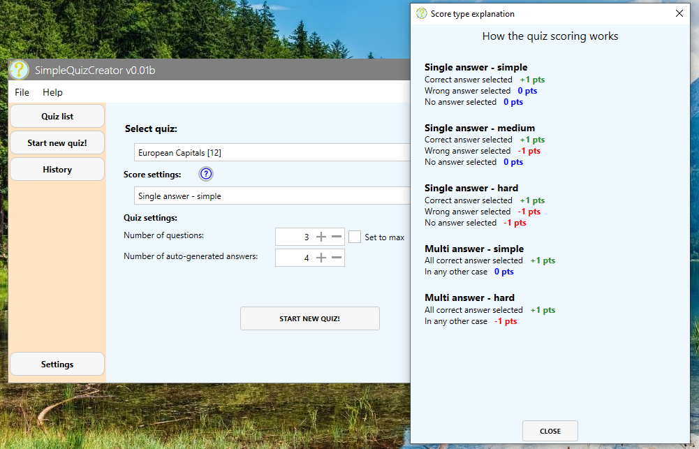

# SimpleQuizCreator

Built using: **WPF, Prism, SQLite**

### About
Simple application for people who do not code on a daily basis. Do you want to prepare for an exam, or maybe just want to learn something new?
Create your own quizzes using simple TXT files.

**Main functionalities:**
- creating quizzes from simple text files
- notification of errors in the quiz
- multiple scoring models
- history of completed quizzes
- several language versions 

**Screenshots:**

[Main wingow](docs/screen_main.png)
[History](docs/screen_history.png)
[Result](docs/screen_result.png)

### How to create a quiz

Look how simple it is:
- one file = one quiz
- on each file as many question as you want
- each question starts with __[Q]__, or __[q]__
- each question may have up to nine answers
- good answers start with __[*]__

### Examples

Look at the example:
file:  **Animals.txt** (file in the quizzes folder)

file content:

    [Q]Which animal has the most extended tail?
    -Elephant
    [*]-Giraffe
    -Cat
    -Cow

    [Q]Which big cat has the loudest roar out of all the big cats?
    -Cat
    [*]-Lion
    -Leopard

    [Q]Which animal has three hearts?
    [*]-Octopus
    -Elephant
    -Whale

#### An example with auto-generated answers. 

If you want to create a quiz where all the data is related to one set, you can do it even easier. All you need to do is add the correct answer to each question. 
Missing answers in the test will be generated automatically.
You can select the number of generated answers before starting the quiz. 

File: **Capitals.txt** (file in the quizzes folder) 

    [q]Spain
    [*]Madrid

    [q]Poland
    [*]Warsaw

    [q]France
    [*]Paris

    [q]Germany
    [*]Berlin

    [q]Greece
    [*]Athens